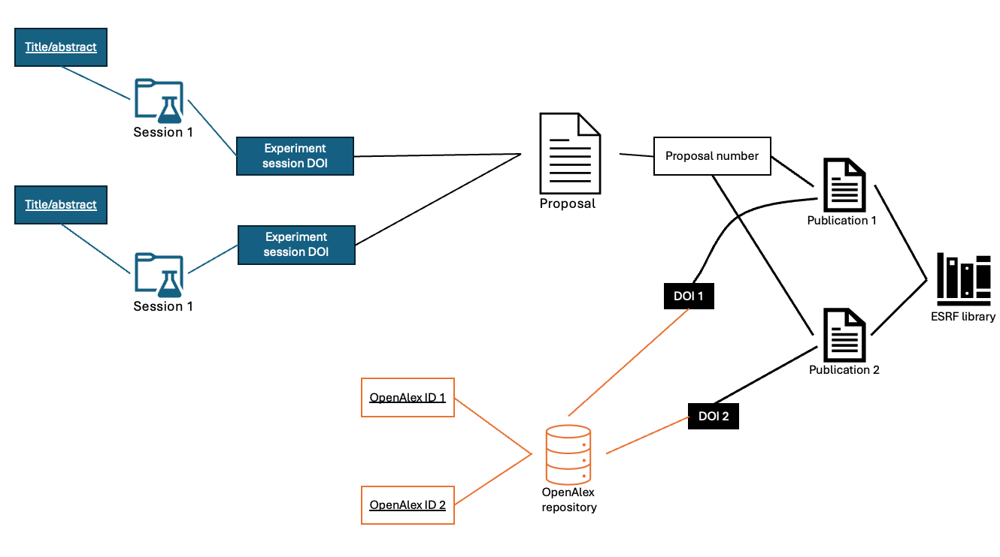

# Topic Classification for synchrotron experimental proposals
## Background
This work develops a data pipeline to assign topics to Photon and Neutron (PaN) experimental proposals.

To use the facilities provided by PaN institutes, potential users have to submit a proposal which will be reviewed. Once approved, the users can then carry out their experiments and possibly publish the results of the experiments. Note that a single proposal could lead to multiple experiment sessions.

Currently, there exist only high-level topic classifications for these proposals. This work aims to provide topics with a greater level of granularity.

The OpenAlex team [1] developed a model and topics vocabulary to classify publications and add them to their growing data repository. The model can be repurposed to classify the experimental proposals instead.

## Methodology
The model developed by the OpenAlex team uses the **Title**, **Abstract**, **Referenced works** (the works that the publication cites), and **Journal name** of the publications to make the topic predictions. 

Similarly, experimental proposals also have **Title** and **Abstract**, which are currently not openly available. However, they are reused in the experiment session metadata, athough certain experiment sessions may have a manually created **Title** and **Abstract**. Hence, we gather all the **Title** and **Abstract** metadata from the experiment sessions, remove any duplicates, and concatenate the rest into one big **Title** and one big **Abstract**. 

For **Referenced works**, the proposal is mapped to all the publications that the former is associated with, using metadata stored by the PaN facilities. 

The **Journal name** is not relevant for experiment proposals. However, we use the **Subject** metadata of the experiment sessions as a substitute.

In order to get the mappings for **Referenced works**, the publications and proposals of the PaN facilities have been gathered and stored in the Datasets folder. The code for the model has also been copied from the OpenAlex GitHub repository (https://github.com/ourresearch/openalex-topic-classification).

## How to use
Download the model artifacts from the Zenodo page [2]. All the other necessary data files are in the Datasets folder. 

There are two Jupyter Notebooks, **Data Processing.ipynb** for importing and processing data, and **Topic classification.ipynb** is for the actual implementation of the model. In order to run these two Notebooks, it is recommended to create a virtual enviroment and install packages using the requirements.txt (which is the one provided on the OpenAlex GitHub repository with some additional packages added to it).

The full dataset of proposals with the corresponding topic predictions can be found in the Datasets folder. For example, the one for ESRF is called **Proposals_ESRF_Predictions**.

## References
[1] Priem, J., Piwowar, H., & Orr, R. (2022). OpenAlex: A fully-open index of scholarly works, authors, venues, institutions, and concepts. ArXiv. https://arxiv.org/abs/2205.01833

[2] Barrett, J. (2024). OpenAlex Topic Classification v1 Model Artifacts and Training Data [Data set]. Zenodo. https://doi.org/10.5281/zenodo.11235511
